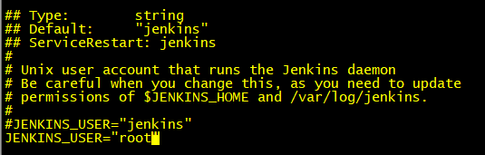

# Jenkins笔记
- [官网](https://jenkins.io/zh/)
## 安装
centos 下使用 `yum install -y jenkins` 即可（速度比较慢需要等）

## 问题

### 没有Docker权限
> Got permission denied while trying to connect to the Docker daemon socket at unix:///var/run/docker.sock: Get http://%2Fvar%2Frun%2Fdocker.sock/v1.26/containers/maven:3.3.3/json: dial unix /var/run/docker.sock: 
> connect: permission denied
- 解决
`sudo usermod -a -G docker jenkinsp`  
并重启 `docker` `jenkins` 或者 服务器
- 参考
  - [stackoverflow](https://stackoverflow.com/questions/47854463/got-permission-denied-while-trying-to-connect-to-the-docker-daemon-socket-at-uni)

### Could not create local repository at /root/.m2/repository
> jenkins在linux中无法创建maven repository问题
> jenkins构建任务时，maven命令报错：Could not create local repository at /root/.m2/repository

- 解决
修改配置文件`/etc/sysconfig/jenkins`，将执行用户改为`root`，然后重启

- 参考
  - [wanbao](https://www.cnblogs.com/wanbao/p/10157067.html)