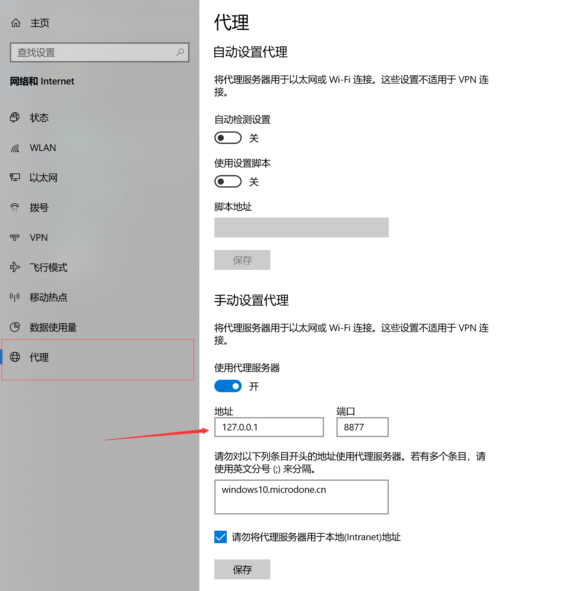
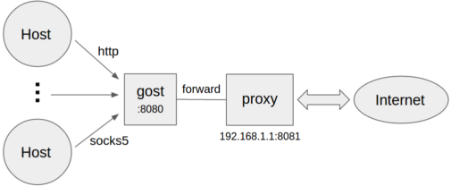

# 共享蓝灯

## 安装

### 本机安装
直接[下载](https://github.com/getlantern/lantern-binaries)安装
### docker安装
- 参考[这里](../linux/centos_apps.md#lantern)

## 局域网共享
win10 -> 设置 -> 网络和 Internet -> 代理:

配置为局域网中的代理

## 进阶
- 已有无限流量蓝灯，如何共享给其他设备（蓝灯还不支持ios）。
- 不满足局域网设置代理，需要在互联网上共享。

### 需要准备
- 一台公网ip服务器，[参考](home_server.md)

### 思路
ios 有一款app--[ssrconnectpro](https://ssrconnectpro.com/),考虑搭一个ss，并把请求转发到lantern的代理端口,如下图：


### 实现
#### ShadowSocks+ProxyChains
搭建`ss`,并用`ProxyChains`为其设置代理
但是`ProxyChains`不支持`https`，此方案放弃。

#### [Gost](https://github.com/ginuerzh/gost)
> gost - GO Simple Tunnel 
> GO语言实现的安全隧道

发现其自带代理加转发功能,一行命令直接搞定：

```bash
# ss://加密方法:密码:端口
# -F 设置代理为lantern的端口
gost gost -L=ss://chacha20:password@:8338 -F=127.0.0.1:3128
```
#### 参考
- https://docs.ginuerzh.xyz/gost/ss/