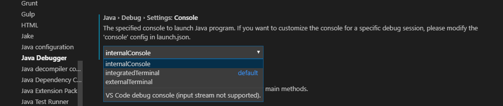
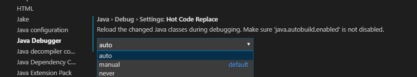

# vscode 使用手册

## 通用
    
## Terminal 使用 bash

1. 安装 [git](https://git-scm.com/download/win).
2. 在 `Terminal` 右上角点击 `选择默认shell` 即可选到 `bash`

- [参考](https://stackoverflow.com/questions/42606837/how-do-i-use-bash-on-windows-from-the-visual-studio-code-integrated-terminal)

## Java IDE

### JAVA Debuger 
#### 控制台输出
```json
{
    "java.debug.settings.console": "internalConsole"
}
```


#### 自动热部署
```json
{
    "java.debug.settings.hotCodeReplace": "auto"
}
```


### Maven Debug


- [参考](https://github.com/microsoft/vscode-maven/issues/49)
- [Support running command before attaching debugger](https://github.com/microsoft/vscode-java-debug/issues/120)