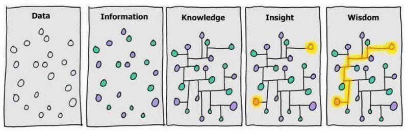

# 文摘

## 工具

### [OID 查询](http://www.oid-info.com/)
通过 OID 编号查询信息，如:`1.2.156.10197.1.501` -> `"SM2" signing with "SM3"`

### [crontab 编辑器](https://crontab.guru)
crontab 是 Linux 系统的定时任务执行器。这个在线工具可以可视化生成 crontab 的配置文件。

## 想法

### 数据、信息、知识、洞察、智慧

### 懒惰、急躁和傲慢（Laziness, Impatience and hubris）
Perl语言的发明人Larry Wall说，好的程序员有3种美德： 懒惰、急躁和傲慢（Laziness, Impatience and hubris）
- From [阮一峰的网络日志    ](http://www.ruanyifeng.com/blog/2006/05/laziness_impatience_and_hubris.html)