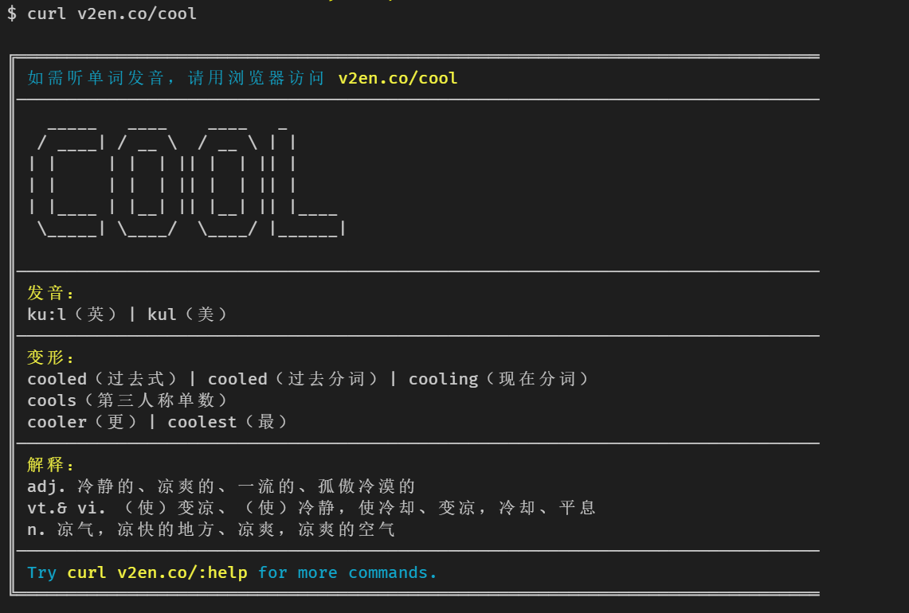
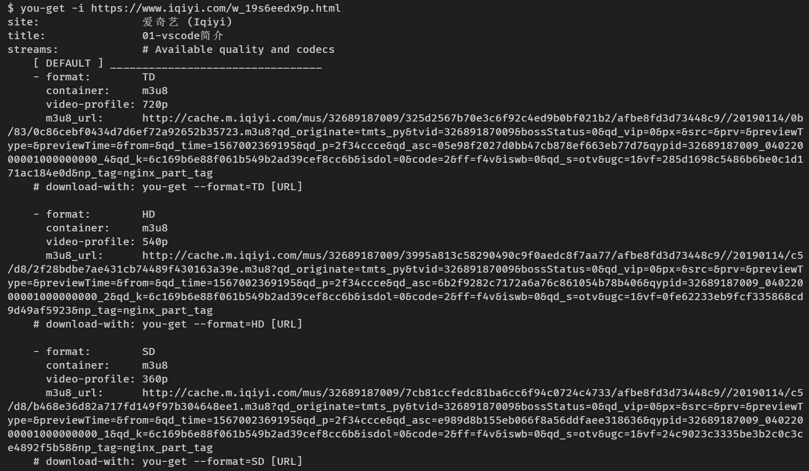
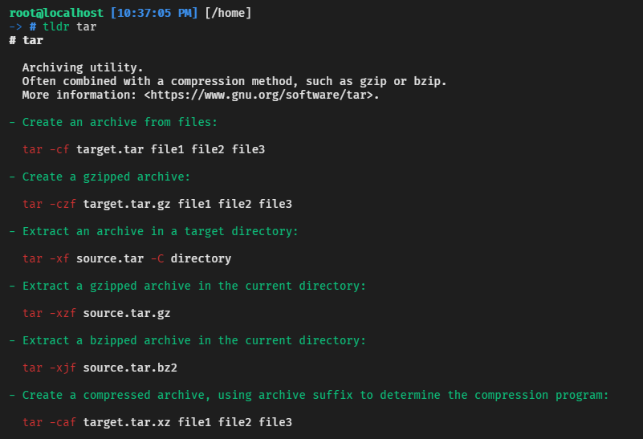

# 命令行笔记 

## `ctrl-r`
在 Bash 中，使用 **ctrl-r** 搜索命令行历史记录（按下按键之后，输入关键字便可以搜索，重复按下 **ctrl-r** 会向后查找匹配项，按下 **Enter** 键会执行当前匹配的命令，而按下右方向键会将匹配项放入当前行中，不会直接执行，以便做出修改）。

## `history`
键入 `history` 查看命令行历史记录，再用 `!n`（`n` 是命令编号）就可以再次执行。其中有许多缩写，最有用的大概就是 `!$`， 它用于指代上次键入的参数，而 `!!` 可以指代上次键入的命令了（参考 man 页面中的“HISTORY EXPANSION”）。不过这些功能，你也可以通过快捷键 **ctrl-r** 和 **alt-.** 来实现。

## `alias`
使用 `alias` 来创建常用命令的快捷形式。例如：`alias ll='ls -latr'` 创建了一个新的命令别名 `ll`。

## `mv foo-bar-{baz,quux}.txt`
变更文件名 将 "foo-bar-baz.txt" 变更为 "foo-bar-quux.txt"

## `python -m http.server 7777`
将 web 服务器上当前目录下所有的文件（以及子目录）暴露给你所处网络的所有用户。  
`python -m SimpleHTTPServer 7777` （使用端口 7777 和 Python 2）  
`python -m http.server 7777` （使用端口 7777 和 Python 3）。

## `curl v2en.co/cool`
命令行查单词,[参考](https://www.zhihu.com/question/41115077/answer/724683831)  


## ssh

### 参考
- [SSH原理与运用](http://www.ruanyifeng.com/blog/2011/12/ssh_remote_login.html)
- [端口转发](http://www.ruanyifeng.com/blog/2011/12/ssh_port_forwarding.html)

## [you-get](https://github.com/soimort/you-get)
You-Get is a tiny command-line utility to download media contents (videos, audios, images) from the Web, in case there is no other handy way to do it.  
支持几乎所有视频网站，包括优酷、土豆、爱奇艺等


### 注意
需要安装依赖 [ffmpeg](#ffmpeg),[参考](https://www.jianshu.com/p/2b98e0f87720)


## [ffmpeg](https://github.com/FFmpeg/FFmpeg)
FFmpeg是处理多媒体内容（如音频，视频，字幕和相关元数据）的库和工具的集合。
### 用法
- MP4 to MP3
```
ffmpeg -i *.mp4 *.mp3
```

- MP4压缩
```
ffmpeg -i 'test.mp4' -y -b:a 2000k -s 1800x1080 'test.min.mp4'
```

- MP4拼接
> 先将 mp4 转化为同样编码形式的 ts 流，因为 ts流是可以 concate 的，先把 mp4 封装成 ts ，然后 concate ts 流， 最后再把 ts 流转化为 mp4。
```
ffmpeg -i 1.mp4 -vcodec copy -acodec copy -vbsf h264_mp4toannexb 1.ts
ffmpeg -i 2.mp4 -vcodec copy -acodec copy -vbsf h264_mp4toannexb 2.ts
ffmpeg -i "concat:1.ts|2.ts" -acodec copy -vcodec copy -absf aac_adtstoasc output.mp4
```

## xargs

### 示例
- 批量转换mp4 to mp3
``` bash
ls *.mp4 | xargs --max-procs 0 -I file sh -c 'ffmpeg -i file ./mp3/file.mp3'
```

### 参考
- [xargs 命令教程](http://www.ruanyifeng.com/blog/2019/08/xargs-tutorial.html)

## [frp](https://github.com/fatedier/frp)
可用于内网穿透的反向代理

## [fzf](https://github.com/junegunn/fzf)
命令行模糊查询工具

### [tldr](https://github.com/tldr-pages/tldr)
A collection of simplified and community-driven man pages.



## awk
> 如果 grep 允许您搜索行，而 sed 允许您在行中进行替换，那么 awk 旨在让您在行上进行计算

https://earthly.dev/blog/awk-examples/

### 使用示例
```
$ echo "one two three" | awk '{ print $1 }'
one
$ echo "one two three" | awk '{ print $2 }'
two
$ echo "one two three" | awk '{ print $3 }'
three
```
```
awk '/hello/ { print "This line contains hello", $0}'

awk '$4~/hello/ { print "This field contains hello", $4}'

awk '$4 == "hello" { print "This field is hello:", $4}'
```

# 参考

- [命令行的艺术](https://github.com/jlevy/the-art-of-command-line/blob/master/README-zh.md)